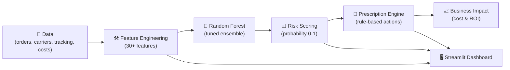

# NexGen Logistics — Predictive Delivery Optimizer 📦

Predict shipment delays **before they happen** using a tuned **Random Forest ensemble model** — and take proactive actions to reduce delays, costs, and customer churn.

---

## 🎯 Problem Statement
Delivery delays lead to:
- 💸 Penalties & operational losses
- 😠 Customer dissatisfaction
- 🔁 Churn and missed revenue
- 📉 SLA violations

**We solve this by:**
- Predicting high-risk shipments
- Prescribing targeted operational actions
- Preventing avoidable delays

---

## 💡 Solution Overview
✅ **End-to-end ML workflow including:**
- Multi-source logistics data ingestion
- 30+ engineered features
- Tuned Random Forest delay classifier
- Probability-based risk scoring
- Actionable prescription engine
- Streamlit UI for user-friendly interaction

---

## 🤖 Machine Learning Approach — Random Forest Ensemble
This project uses a `RandomForestClassifier` optimized via `GridSearchCV`.

| Why Random Forest? | Benefit | Impact |
|---|---|---|
| Bagging (Bootstrap sampling) | Lower variance, reduced overfitting |
| Random feature subset per split | Better generalization |
| Ensemble voting | Stability + accuracy |
| Probabilistic outputs | Risk-based prioritization |

**Final Tuned Model Example:**
```python
RandomForestClassifier(
    n_estimators=100,
    max_depth=None,
    min_samples_split=2,
    min_samples_leaf=1,
    max_features='sqrt',
    random_state=42
)
```

---

## ✅ Model Evaluation Summary

### 1️⃣ Overall Metrics
| Metric | Value |
|---|---|
| Accuracy | 0.9737 |
| Precision | 1.0000 |
| Recall | 0.9444 |
| F1-Score | 0.9714 |
| ROC-AUC | 1.0000 |
| Average Precision | 1.0000 |

✅ Zero false alarms
✅ Nearly every real delay detected
✅ Perfect class separation (AUC = 1.0)

### 2️⃣ Classification Report
```
              precision    recall  f1-score   support
On-Time         0.95      1.00      0.98        20
Delayed         1.00      0.94      0.97        18
```

### 3️⃣ Confusion Matrix
```
[[20  0]
 [ 1 17]]
```
| Metric | Value |
|---|---|
| True Negatives | 20 |
| False Positives | 0 |
| False Negatives | 1 |
| True Positives | 17 |

⚙ Only one delayed order was missed — can be improved via threshold tuning.

---

## 📌 Business Interpretation
| Outcome | Benefit |
|---|---|
| 94% delays proactively detected | Reduced penalties & escalations |
| Zero unnecessary alerts | Saves operational time & costs |
| High trust & adoption | Better customer experience |

🚀 Drives **proactive logistics**, boosts **CSAT** & operational efficiency.

---

## 🏗️ Architecture
## 🏗️ Architecture

Below is a visual, easy-to-scan architecture for the Predictive Delivery Optimizer — a data → model → action pipeline that powers the Streamlit dashboard and prescription engine.

### Visual (Mermaid)



### ASCII fallback

```
    [Data: orders, carriers, tracking, costs]
                                 |
                                 v
    [Feature Engineering (30+ features)]
                                 |
                                 v
    [Random Forest Model (tuned ensemble)]
                                 |
                                 v
    [Risk Scoring (probability 0-1)] ---> [Streamlit Dashboard]
                                 |
                                 v
    [Prescription Engine (rules & actions)] ---> [Streamlit Dashboard]
                                 |
                                 v
    [Business Impact & Reporting (costs, ROI, saved orders)]
```

Notes:
- The feature engine produces a stable set of features used by both training and inference.
- The prescription engine takes score + features as input and generates prioritized actions (carrier swap, reroute, priority upgrade, etc.).
- The Streamlit UI surfaces high-risk orders, recommended actions, and business impact metrics for operations teams.

---

## 📦 Project Structure
```
nexgen_predictive_delivery_optimizer/
├── app.py
├── requirements.txt
├── README.md
├── innovation_brief_template.md
├── src/
│   ├── data.py
│   ├── features.py
│   ├── model.py
│   ├── rules.py
│   └── utils.py
└── models/
```
> Data CSVs must be stored in `data/` (gitignored).

---

## 🚀 Quickstart
```bash
pip install -r requirements.txt
streamlit run app.py
```
Open: `http://localhost:8501`
Open in browser (local):

http://localhost:8501

Deployed app (live):

https://nexgenpredictivedeliveryoptimizer-g7y7zpgu4uc8r3rq2dgtkp.streamlit.app/#200

---

## 💊 Prescriptive Actions
Includes automated recommendations such as:
- Carrier Swap 🚚
- Route Optimization 🗺️
- Priority Upgrade ⚡
- Vehicle Reassignment 🚗
- Warehouse Reroute 🏭
- Weekend Surge Planning 📆
- Proactive Customer Alerts 📧

Each includes:
- Priority
- Estimated delay reduction %
- Cost impact analysis

---

## 🧪 Testing with Synthetic Data
Sample data generation script included for quick demo and testing.

---

## 📈 Future Enhancements
- SHAP Explainability
- FastAPI endpoint for real-time predictions
- Dockerized deployment
- Drift monitoring & auto-retraining
- Alerting integration (Slack / Email)
- Cost-aware optimization modeling

---

## 👨‍💻 Author
**Rahul Mishra**

GitHub Repository: https://github.com/RahulMishra09/nexgen_predictive_delivery_optimizer.git

---

## 📄 License
MIT License — free for open collaboration & innovation

> Built with ❤️ to make logistics reliably on time.
